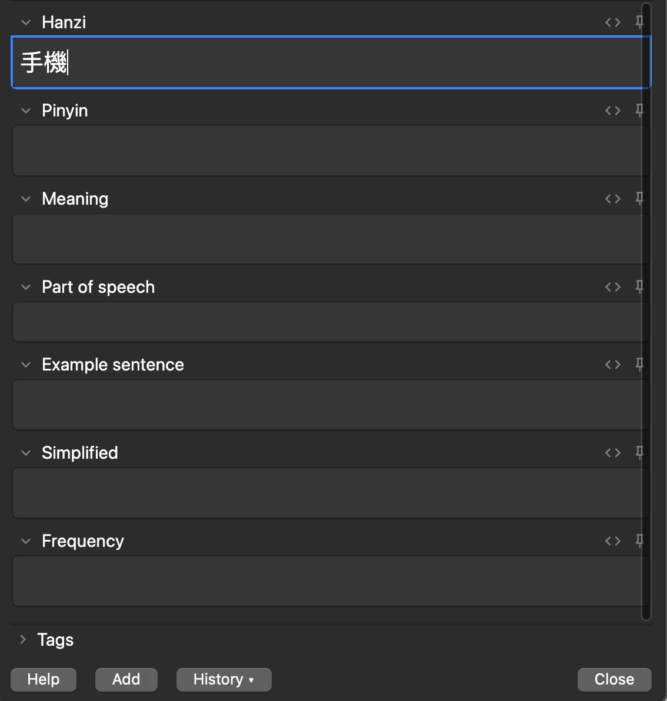
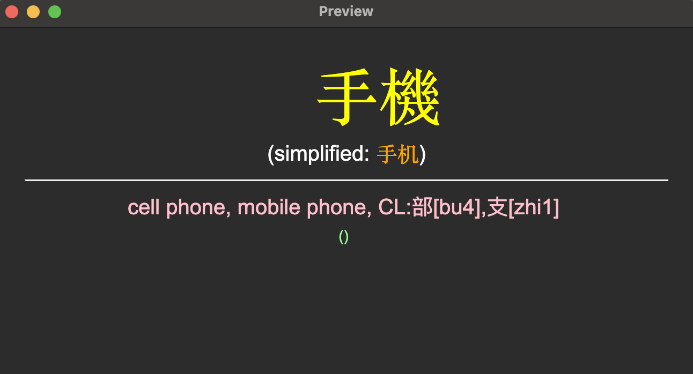

# Chinese Autofill Add-On

A simple Anki add-on which auto-fills fields when making cards.

Add the character/phrase to the Hanzi field:

Then switching to a new field will auto-fill other fields:

Then the card can be displayed with the new fields.

